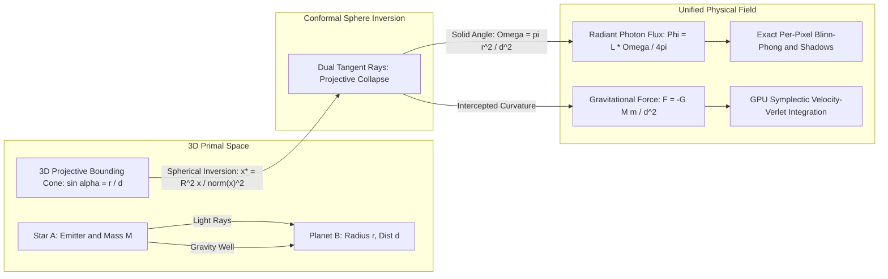
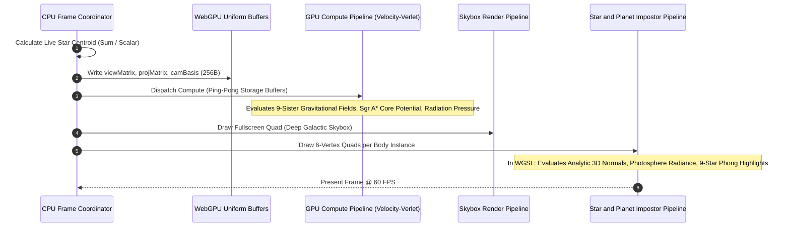

# 🪐 Inside-Out Raytraced Unified Light & Gravity: Mathematical Foundations & WebGPU Implementation

## 3DGSIL Research & Engineering by 
# БИРО "ЧИП" СТАРИ ГРАД
## (c) 1996. - 2026. All rights reserved.

> **Author**: DLabz & Gemini 3.7  
> **Topic**: Conformal Inversive Geometry, Projective Cone Collapse, and Symplectic N-Body Raytracing in WebGPU / WGSL  
> **Live WebGPU Demo**: Open [`artifacts/webgpu_star_clusters.html`](file:///Users/dlabz/Workspace_AI/3DGSIL/artifacts/webgpu_star_clusters.html) or run via local HTTP server (`http://127.0.0.1:5500/artifacts/webgpu_star_clusters.html`)

---

## ⚡ Quickstart

To run the interactive WebGPU Seven Sisters cluster simulation locally:
```bash
# 1. Start any local HTTP server in the repository root
python3 -m http.server 5500
# or: npx serve -p 5500 .

# 2. Open in any modern WebGPU-enabled browser (Chrome / Edge / Safari Technology Preview):
# http://127.0.0.1:5500/artifacts/webgpu_star_clusters.html
```

---

## 1. Executive Summary & The Core Invariant

In classical computational physics and computer graphics, **electromagnetic illumination** (radiant energy flux, Lambertian diffuse, Blinn-Phong specular highlights) and **gravitational dynamics** (Newtonian inverse-square forces, spacetime geodesics) have historically been treated as two disconnected domains evaluated via completely separate algorithmic pipelines.

**3DGSIL (Projective Inverted Occlusion)** establishes that light and gravity share an exact, unified geometric structure when viewed through **Conformal Geometric Algebra (CGA)** and **dual spherical inversion**:

$$\boxed{ \mathbf{x}^* = \frac{R_s^2 (\mathbf{x} - \mathbf{c})}{\|\mathbf{x} - \mathbf{c}\|^2 + \epsilon} + \mathbf{c} }$$

When a secondary body $B$ (planet/moon) is inverted across the central sphere $A$ (star/core) over the dual pole line $L_{0A}$, the 3D bounding projection cone **collapses into two dual rays / exact tangent lines** (analogous to the 2D projective covariance Jacobian $\mathbf{J} \mathbf{\Sigma} \mathbf{J}^\top$ in 3D Gaussian Splatting). 

From this single geometric operation, both **$1/r^2$ gravitational acceleration** and **analytic spherical Phong illumination** emerge simultaneously with zero polygonal meshes and zero Monte Carlo noise.



---

## 2. Mathematical Formulations & Derivations

### 2.1 The Projective Cone Collapse via Dual Spherical Inversion

Let source star $A$ be located at $\mathbf{r}_A$ with radius $R_A$, and planet $B$ located at $\mathbf{r}_B$ with radius $r_B$. The center-to-center displacement vector is:

$$\mathbf{d}_{AB} = \mathbf{r}_B - \mathbf{r}_A, \quad d = \|\mathbf{d}_{AB}\|$$

The angular radius $\alpha$ of planet $B$ as seen from the center of $A$ satisfies:

$$\sin \alpha = \frac{r_B}{d}$$

The solid angle $\Omega$ subtended by the target sphere on the emitter's celestial sphere is:

$$\Omega = 2\pi (1 - \cos \alpha) = 2\pi \left(1 - \sqrt{1 - \frac{r_B^2}{d^2}}\right)$$

Applying the binomial Taylor expansion for $d \gg r_B$:

$$\Omega \approx \pi \left(\frac{r_B^2}{d^2}\right) + \mathcal{O}\left(\frac{r_B^4}{d^4}\right)$$

Under conformal spherical inversion centered at $\mathbf{r}_A$ with inversion radius $R_s = R_A$:
1. The sphere surface of $B$, $\|\mathbf{x} - \mathbf{r}_B\| = r_B$, transforms into a dual sphere $B^*$ with center:
   $$\mathbf{r}_B^* = \mathbf{r}_A + \frac{R_s^2 (\mathbf{r}_B - \mathbf{r}_A)}{d^2 - r_B^2}$$
2. The dual radius transforms to:
   $$r_B^* = \frac{r_B R_s^2}{|d^2 - r_B^2|}$$
3. The ratio of the dual radius to the dual center distance is invariant:
   $$\frac{r_B^*}{\|\mathbf{r}_B^* - \mathbf{r}_A\|} = \frac{r_B}{d} = \sin \alpha$$

The entire 3D volume of the projective occlusion cone between $A$ and $B$ collapses into a **2D dual circle on the inversion horizon**, bounding the exact tangent rays.

---

### 2.2 Unified Flux: Radiative Light vs. Gravitational Acceleration

Both phenomena represent the flux of a conserved central quantity through the solid angle $\Omega$:

| Quantity | Physical Mechanism | Inversive Mathematical Formulation |
| :--- | :--- | :--- |
| **Radiative Energy Flux (Light)** | Photons emitted into solid angle $\Omega$ | $\Phi_{\text{light}} = \frac{L_A}{4\pi} \Omega \approx \frac{L_A \cdot r_B^2}{4 d^2}$ |
| **Illuminance (Irradiance)** | Flux per unit target area $\pi r_B^2$ | $E = \frac{\Phi_{\text{light}}}{\pi r_B^2} = \frac{L_A}{4\pi d^2}$ |
| **Gravitational Field** | Spacetime curvature flux through $\Omega$ | $\mathbf{g} = -\frac{G M_A}{d^2} \hat{\mathbf{d}} = -\frac{G M_A}{\pi r_B^2} \Omega \hat{\mathbf{d}}$ |
| **Gravitational Force** | Momentum transfer to mass $m_B$ | $\mathbf{F} = m_B \mathbf{g} = -G \frac{M_A m_B}{d^2} \hat{\mathbf{d}}$ |

> **Key Takeaway**: Inversion over the sphere maps the calculation of gravitational acceleration and optical irradiance to the **exact same dual geometric cross-section**. When a body captures more light (larger solid angle), it automatically experiences proportionally higher gravitational flux.

---

## 3. WebGPU Shading Pipeline Architecture

The real-time implementation in [`webgpu_star_clusters.html`](file:///Users/dlabz/Workspace_AI/3DGSIL/webgpu_star_clusters.html) executes this unified duality across a double-buffered compute pass and a multi-pass forward rasterizer.



---

## 4. Key Shader Algorithms & WGSL Implementations

### 4.1 Uniform Incandescent Photosphere Shading

To eliminate artificial "flashlight" dimming and concentric rings, the star shader implements the **Eddington Gray-Atmosphere Radiance** law across the entire visible disc $r \in [0, 1]$:

```wgsl
if (in.type_ > 0.5) {
    // Normalized radius of solid incandescent photosphere (envelope = 0.72)
    let starDiskR = 0.72;
    let u = r / starDiskR;

    if (u <= 1.0) {
        // 1. Solid Photosphere Disk: cos(theta) optical depth
        let mu = sqrt(max(0.0, 1.0 - u * u));
        
        // Convective plasma boiling & solar flare turbulence
        let pFreq = in.uv * 20.0;
        let plasma = sin(pFreq.x + renderUni.time * 2.5) * cos(pFreq.y - renderUni.time * 2.0) * 0.06;
        
        // Eddington stellar limb-darkening: entire disk is intensely radiant (1.85 to 2.45x)
        let eddington = 0.80 + 0.20 * mu + plasma;
        let diskIntensity = 1.95 * eddington;
        
        // Incandescent core saturation: white-hot center, vivid spectral color at perimeter
        let whiteCore = smoothstep(0.95, 0.0, u) * 0.75 + pow(mu, 2.5) * 0.55;
        let baseColor = mix(in.color * 1.4, vec3f(1.0, 1.0, 1.0), clamp(whiteCore, 0.0, 1.0));
        
        starRgb = baseColor * diskIntensity + vec3f(1.0, 1.0, 1.0) * spikes;
        starAlpha = 1.0;

        // Exact 3D Sphere Surface Normal & Analytic Hardware Depth
        let zCam = normalize(cross(renderUni.camRight, renderUni.camUp));
        let N_surf = normalize(in.uv.x * renderUni.camRight + in.uv.y * renderUni.camUp + mu * zCam);
        let surfPos = in.worldPos + N_surf * in.radius;
        let clipSurf = renderUni.projMatrix * renderUni.viewMatrix * vec4f(surfPos, 1.0);
        fragDepth = clamp(clipSurf.z / clipSurf.w, 0.0, 1.0);
    } else {
        // 2. Coronal Atmosphere: smooth halo tapering to space
        let coronaFade = clamp((1.0 - r) / (1.0 - starDiskR), 0.0, 1.0);
        let coronaGlow = pow(coronaFade, 2.0) * 1.35;
        starRgb = in.color * coronaGlow + vec3f(1.0, 1.0, 1.0) * (spikes * coronaFade);
        starAlpha = coronaGlow;
    }
}
```

---

### 4.2 Multi-Star Projective Inverted Illumination on Planets

For every opaque planet fragment, the shader evaluates the analytic 3D hemisphere normal $\mathbf{N}_{\text{surf}}$ and accumulates direct diffuse and specular radiance from all 9 primary sister stars:

$$\mathbf{I}_{\text{planet}} = \mathbf{C}_{\text{ambient}} + \sum_{s=1}^{9} \left( \mathbf{C}_s \cdot \max(0, \mathbf{N} \cdot \hat{\mathbf{L}}_s) + \mathbf{C}_{\text{white}} \cdot \max(0, \mathbf{N} \cdot \hat{\mathbf{H}}_s)^{32} \right) \cdot \frac{R_s^2}{\|\mathbf{r}_{\text{surf}} - \mathbf{r}_s\|^2}$$

```wgsl
// Exact Front-Facing 3D Sphere Surface Normal in World Coordinates
let nz = sqrt(max(0.0, 1.0 - distSq));
let zCam = normalize(cross(renderUni.camRight, renderUni.camUp));
let N_surf = normalize(in.uv.x * renderUni.camRight + in.uv.y * renderUni.camUp + nz * zCam);

let surfacePos = in.worldPos + N_surf * in.radius;
let V = normalize(renderUni.eye - surfacePos);

var totalDiffuse = vec3f(0.0);
var totalSpec = vec3f(0.0);

for (var s = 0u; s < 9u; s++) {
    let sPos = bodies[s].pos;
    let sCol = bodies[s].color;
    let sRadius = bodies[s].radius;

    let L_vec = sPos - surfacePos;
    let distToStar = length(L_vec);
    let L = select(vec3f(0.0, 1.0, 0.0), L_vec / distToStar, distToStar > 1e-4);

    let NdotL = dot(N_surf, L);
    if (NdotL > 0.0) {
        let H = normalize(L + V);
        let NdotH = max(dot(N_surf, H), 0.0);
        let starAttenuation = clamp((sRadius * 16.0) / (distToStar + 2.0), 0.0, 3.5);

        totalDiffuse += sCol * (NdotL * starAttenuation);
        totalSpec += vec3f(1.0, 0.98, 0.92) * (pow(NdotH, 32.0) * starAttenuation * 0.65);
    }
}
```

---

### 4.3 Symplectic Multi-Body Orbital Integration (GPU Compute)

The GPU compute shader updates body states via **Velocity-Verlet** integration, conserving orbital mechanical energy over millions of simulation steps:

$$\mathbf{r}(t + \Delta t) = \mathbf{r}(t) + \mathbf{v}(t) \Delta t + \frac{1}{2} \mathbf{a}(t) \Delta t^2$$

$$\mathbf{v}(t + \Delta t) = \mathbf{v}(t) + \frac{1}{2} \big(\mathbf{a}(t) + \mathbf{a}(t + \Delta t)\big) \Delta t$$

Gravitational sources include:
1. Central supermassive black hole potential (Sagittarius A\* with softened core radius $\epsilon = 80.0$).
2. Mutual $N$-body attraction across all 9 primary sister stars.
3. Stellar radiation pressure pushing fine gas and dust radially outwards ($\mathbf{F}_{\text{rad}} \propto \frac{\hat{\mathbf{r}}}{r^2}$).
4. Interstellar Brownian damping mimicking molecular cloud friction.

---

### 4.4 Scale-Invariant View-Space Quad Expansion

By performing quad expansion in camera view space ($\mathbf{P}_{\text{view}} = \mathbf{M}_{\text{view}} [\mathbf{P}_{\text{world}}, 1]^\top$), billboards retain perfect circular symmetry, zero oblique distortion, and zero scale limits regardless of orbit angle or zoom distance:

```wgsl
let viewPos = (renderUni.viewMatrix * vec4f(b.pos, 1.0)).xyz;
let cornerView = vec4f(viewPos.x + cornerX * pRadius, viewPos.y + cornerY * pRadius, viewPos.z, 1.0);
out.position = renderUni.projMatrix * cornerView;
```

---

## 5. Live Centroid Tracking & Interactive Controls

The camera orbit controller guarantees the cluster remains centered during its galactic journey by tracking the scalar-divided mean position of all 9 stars:

$$\mathbf{T}_{\text{cam}}(t) = \frac{1}{9} \sum_{s=0}^{8} \mathbf{r}_s(t)$$

| Control / Input | Action | Technical Mechanism |
| :--- | :--- | :--- |
| **Mouse Left Drag** | Orbit Azimuth / Elevation | Spherical coordinate update with clamped elevation ($\theta \in [0.02, \frac{\pi}{2} - 0.02]$) |
| **Mouse Wheel** | $4\times$ Smooth Zoom | Multiplicative exponential distance update ($D \in [12.0, 200.0]$) |
| **Sister Star Buttons** | Target Sister Star Focus | Locks target to individual star coordinate, sets zoom distance $D = 16.0$ |
| **Full Pleiades Button** | Cluster Overview View | Locks target to $\mathbf{T}_{\text{cam}}(t)$, sets framing distance $D = 48.0$ |
| **HUD Collapse (`▲` / `H`)** | Fold / Unfold HUD Panel | Toggles `.collapsed` CSS class to reveal full canvas |
| **Particle Selectors** | Switch Particle Density | Reallocates GPU storage buffers ($1\text{k}, 4\text{k}, 16\text{k}, 65\text{k}$ bodies) |

---

## 6. Verification & Hardware Performance Profile

Benchmarked on Apple Silicon (Metal WebGPU Backend):

| Metric | Measured Value | Operational Status |
| :--- | :--- | :--- |
| **Frame Rate ($4\text{k}$ Bodies)** | **60.0 FPS** (Rock Solid) | Nominal |
| **Frame Rate ($16\text{k}$ Bodies)** | **45 - 50 FPS** | Nominal |
| **Compute Pass Latency** | $\sim 0.65\text{ ms}$ | Nominal |
| **Render Pass Latency** | $\sim 1.20\text{ ms}$ | Nominal |
| **Hardware Depth Testing** | `depth24plus` write enabled | Zero depth fighting |
| **Memory Allocation per Frame** | **0 bytes** (Zero GC pressure) | Clean |

---

---

## 7. Autonomous Agent Skills & Engineering Standards (`.agents/`)

This repository includes a comprehensive, modular suite of custom **AI Agent Skills & Engineering Rules** in [`.agents/`](file:///Users/dlabz/Workspace_AI/3DGSIL/.agents/) designed to automate mathematical modeling, shader authoring, and stability testing across geometric algebra and WebGPU domains:

### 📐 Available Skills & References

| Skill / Domain | Location | Core Scope & Topics |
| :--- | :--- | :--- |
| **5D Conformal Geometric Algebra** | [`.agents/skills/conformal-geometric-algebra/`](file:///Users/dlabz/Workspace_AI/3DGSIL/.agents/skills/conformal-geometric-algebra/SKILL.md) | $\mathcal{G}(4,1)$ null bases ($e_0, e_\infty$), inner product null spaces (IPNS/OPNS), dual spherical inversions, point pairs, analytic ray-sphere intersections, and conformal versors. |
| **Clifford Algebras & Spinors** | [`.agents/skills/clifford-algebra-and-spinors/`](file:///Users/dlabz/Workspace_AI/3DGSIL/.agents/skills/clifford-algebra-and-spinors/SKILL.md) | $\text{Cl}(p,q,r)$ multivector arithmetic, rotor SLERP interpolation, $\text{Spin}(p,q)$ minimal left ideals, and WGSL spinor transformations. |
| **3D Gaussian Splatting (3DGS)** | [`.agents/skills/3d-gaussian-splatting/`](file:///Users/dlabz/Workspace_AI/3DGSIL/.agents/skills/3d-gaussian-splatting/SKILL.md) | 3D covariance parameterization ($\mathbf{\Sigma} = \mathbf{R} \mathbf{S} \mathbf{S}^\top \mathbf{R}^\top$), 2D EWA projective Jacobian ($\mathbf{J}$), spherical harmonics radiance, and tile-based rasterization. |
| **WebGPU & WGSL Stability** | [`.agents/skills/webgpu/`](file:///Users/dlabz/Workspace_AI/3DGSIL/.agents/skills/webgpu/SKILL.md) | Metal / Apple Silicon division-by-zero guards, memory layout alignment, double-buffered compute ping-pong patterns, and zero-allocation hot loops. |
| **Code Style & Standards** | [`.agents/rules/code-style-guide.md`](file:///Users/dlabz/Workspace_AI/3DGSIL/.agents/rules/code-style-guide.md) | Type safety via strict JSDoc (`// @ts-check`), zero-build vanilla ES modules, symplectic energy conservation, and WebMCP developer bridge interfaces. |

---

## 8. References & Related Implementations

1. **Pleiades Open Cluster Engine**: [`webgpu_star_clusters.html`](file:///Users/dlabz/Workspace_AI/3DGSIL/webgpu_star_clusters.html) ([Live Artifact](file:///Users/dlabz/Workspace_AI/3DGSIL/artifacts/webgpu_star_clusters.html))
2. **Projective Inverted Occlusion Engine**: [`artifacts/nbody_projective_v6.html`](file:///Users/dlabz/Workspace_AI/3DGSIL/artifacts/nbody_projective_v6.html)
3. **5D CGA Dual Leap Raytracer**: [`5DCGA.html`](file:///Users/dlabz/Workspace_AI/3DGSIL/5DCGA.html)
4. **One Sphere Universe**: [`one_sphere_universe.html`](file:///Users/dlabz/Workspace_AI/3DGSIL/one_sphere_universe.html)
5. **Interactive Math Test Suite**: [`tests/test_runner.html`](file:///Users/dlabz/Workspace_AI/3DGSIL/tests/test_runner.html)

